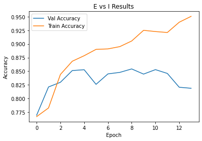
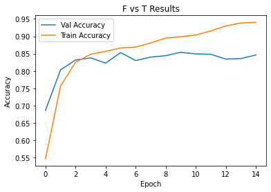
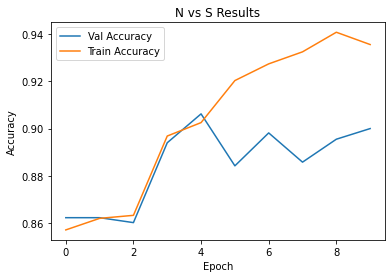
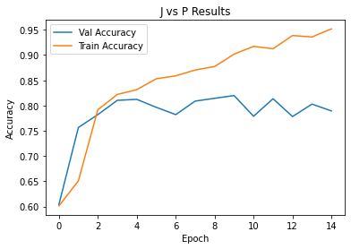

# Predicting Myers-Briggs Personality Types
## Classification of Personality Types From Twitter Postings
### Presented by Rebecca Wright

  

## Overview

We wanted to create a NLP classifier to determine a person's Myers-Briggs personality type based on their informal social media postings.  An individual can be scored as one of 16 Myers-Briggs personality types.  These 16 individual types are derived from 4 main personality trait categories: Introversion vs Extroversion, Feeling vs Thinking, Judging vs Perceiving, and Intuitive vs Sensing.

### Scope

A [Myers-Briggs Personality Type Database](https://www.kaggle.com/datasnaek/mbti-type) was sourced from [Kaggle](https://www.kaggle.com/datasnaek/mbti-type).

The dataset contained over 8600 rows of individual user data containing:
* Personality Type (a 4 letter MBTI code/type, eg. INTP)
* A block of the last 50 postings made by the user (separated by "|||" (3 pipe characters))

### Questions Considered For Analysis:
* Can correlations be seen between certain MBTI types and any of the following:
    - Sentiment analysis score
    - Avg word count per post
    - Part of speech text composition percentages
    - General word usage

## File Directory / Table of Contents

* Data folder (hosted on *GoogleDrive*) [Data Files Linked Here](https://drive.google.com/drive/folders/1RkWZeHrV45Ydn2tLBo6uvypJGlOrlHY4?usp=sharing)
    - original
        * mbti_1.csv
    - cleaned
        * mbti_v5.csv
        * expanded_mbti_df.csv
        * custom_stopwords.txt
        * df_cv_feat_lemma.pkl
        * df_tf_feat_lemma.pkl
        * countvect_matrix_lemma.npz
        * tfidf_matrix_lemma.npz
        * mbti_no_stop_pos_tag_with_sums.csv
        * mbti_pos_tag_df.csv
1. Code folder
    - 01_cleaning
        * 1_cleaning_process_mbti.ipynb
        * 2_generate_df_features_vecttext.ipynb
        * 3_generate_pos_tag_features.ipynb
        * 4_generate_vectorized_matrices.ipynb
        * 5_generate_ngrams_logreg.ipynb
        * 6_generate_ngrams_SVC.ipynb
    - 02_eda
        * 1_eda.ipynb
        * 2_eda.ipynb
        * 3_eda.ipynb
    - 03_models
        * 1_keras_final.ipynb
        * 2_keras_E_I.ipynb
        * 3_keras_F_T.ipynb
3. Presentation folder
    - capstone_presentation.pdf
4. Images folder
    - contains image files displayed by README.md
    * workflow_diagrams
        * capstone_model_builds.png
        * capstone_model_results.png
        * capstone_workflow.png
        * refined_capstone_workflow.png
  

## Data Section: 

### Initial Sentiment Analysis Performed
* utilized vader sentiment analysis for use as engineered features

### Data Cleaning Performed
* cast to lowercase
* removal of any string containing a digit
* removal of websites
* removal of special characters
* removal of stopwords

### Part-of-Speech Tagging 
* utilized nltk part-of-speech tagger
* calculated percantages of text comprised of each pos_tag as engineered features

  

## Methods Section: 

### Null Predictive Models

Null models, creating classification predictions based on *most frequent* classification of each binary personality trait had the following results:
* Comparing E vs I:  **77%**
    - I : 0.769568
    - E : 0.230432

* Comparing F vs T:  **54%**
    - F : 0.541095
    - T : 0.458905

* Comparing N vs S:  **86%**
    - N : 0.862017
    - S : 0.137983

* Comparing J vs P:  **60%**
    - J : 0.60415
    - P : 0.39585

### Recurrent Neural Networking Model
A recurrent neural network model was developed that took advantage of the keras tokenizer and word embedder functionalities.  These functions were applied to the cleaned post text, which was then passed through a series of hidden layers as outlined in [the final keras model notebook](code/3_models/1_keras_final.ipynb).

When considering if an individual was one or the other of the two personality options considered under each of the four personality types, for example whether a person was an Introvert (I) or an Extrovert(E), the final model was able to classify an individual's personality type within each category at accuracy levels exceeding those of the null model.

### Summarized Results

While the final model was able to perform with better accuracy than the null models, a caveat must be added as to the final corpus used by the neural network.  In previous models, a custom_stopword collection had been created to strip all self-references to a users personality type that might be found within the post text content.  It is likely that the classification predictions performed here are influenced by the existence of these personality terms, and further work should be done to reimplement these models on text stripped of the full custom_stopword collection.

### Revisiting The Earlier Additional Questions:
* Can correlations be seen between certain MBTI types and any of the following:
    - *Avg word count per post* **A calculated range of 20 avg words per post was seen between individual personality types of the 16 unique types.  This does not connect to an obvious difference between the averages of the higher level personality trait, but the area warrants further exploration.**
    - *Part of speech text composition percentages* **No dramatic differences were seen when comparing the 4 main personality types internally.**    
    - *Sentiment analysis score* **Features have been extracted and warrant application in future models**
